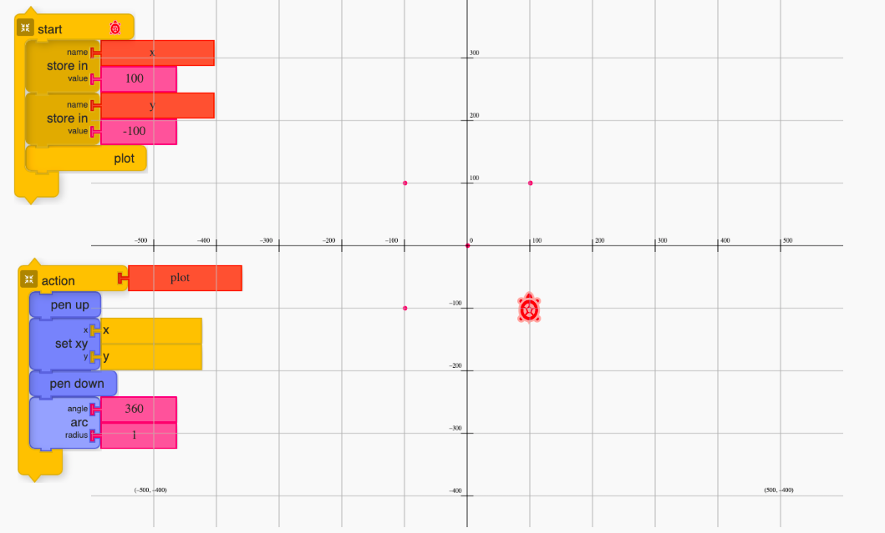
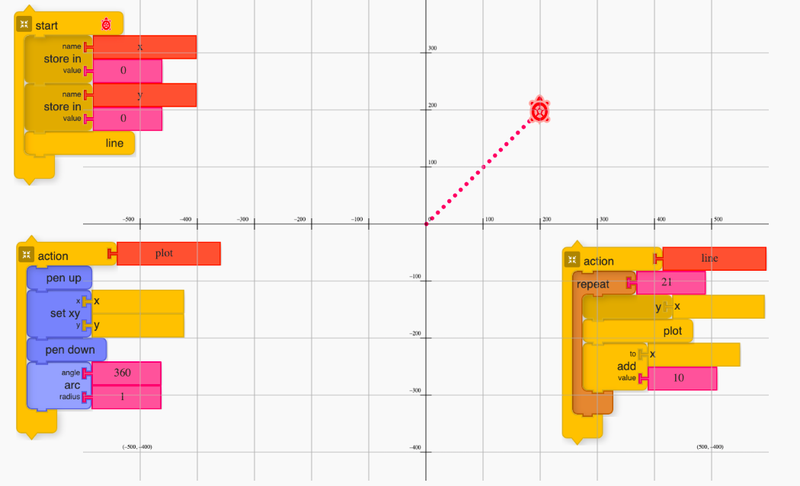
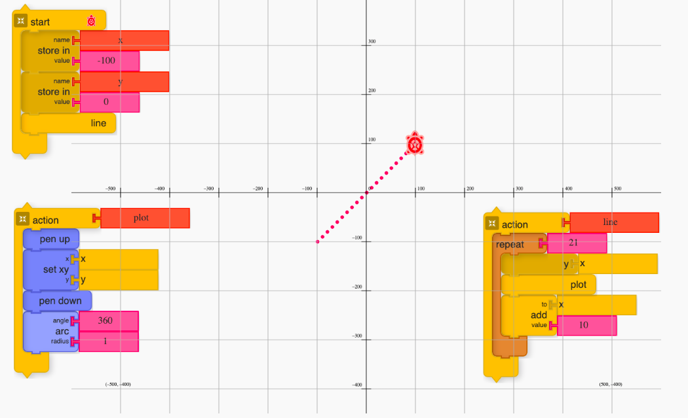
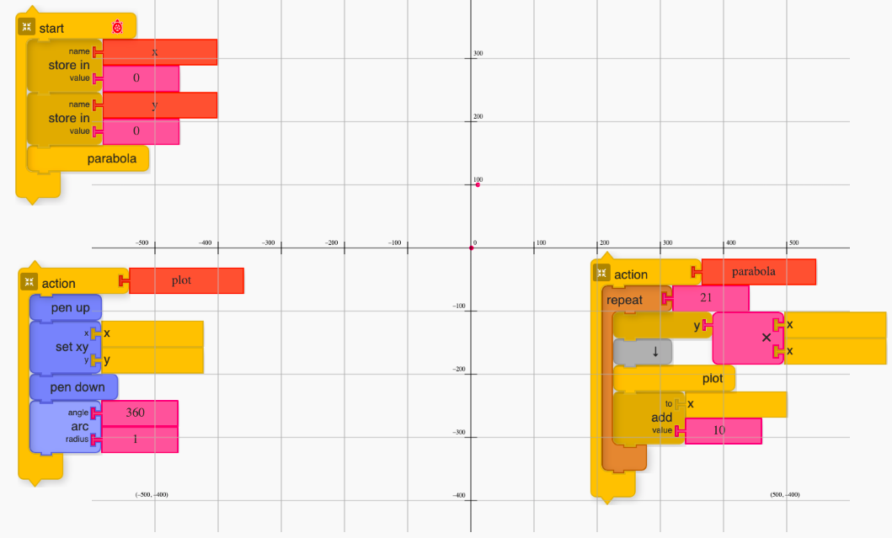
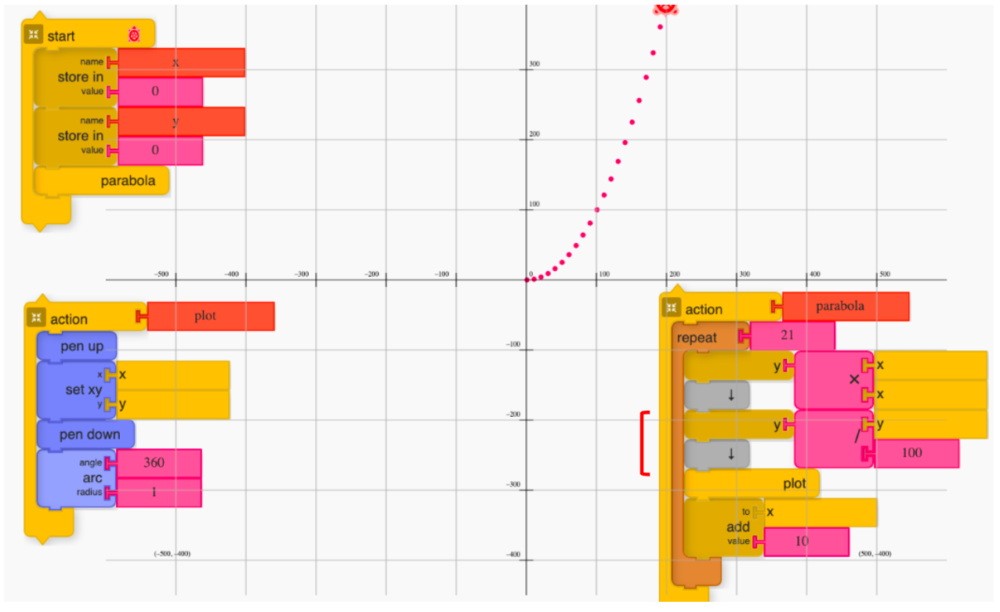
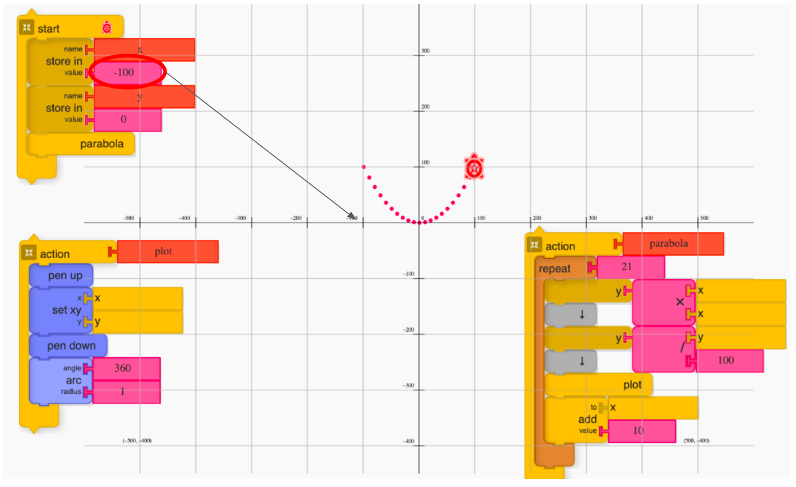

# Turtle Graphics to introduce Coordinate Geometry

Turtle Graphics is considered as one of the powerful instantiation of a constructionist learning environment to introduce foundational programming concepts in an art-based context.(cite?) Its potentiality also has been explored by several researchers (Papert, 1980; Abelson and DiSessa, 1981; Newell, 1988) to introduce mathematical ideas in an exploratory way.

The NCF(National Curriculum Framework) 2005 embraces meaningful ways in which ICT can be integrated to teach discipline based subjects. However, despite its popularity, the seamless integration of turtle Graphics in the mathematics curricula designed by the National Council of Educational Research and Training (NCERT) has not been observed. Though, there has been the peripheral introduction to the platform as one of the chapters in Grade 7 and an independent unit in the ICT module for Grade 9. NCERT is an apex organization set up by the Government of India to advise on curriculum design and pedagogy related to school education.  

One of the reason why turtle Graphics is not yet been part of mainstream mathematics curricula is because often the kind of mathematical ideas which can be explored in turtle Graphics environment are different from the one that has been conventionally found in the syllabus, though equally important. For instance, DiSessa (Abelson and DiSessa, 1981) highlighted how the turtle geometry differs from the cartesian geometry and elaborated on detailed exploration of the former. 
The easiest approach to make turtle Geometry mainstream would be to add it as part of core syllabus, however that would require systemic reform. A practical approach could be to explore ways, and ask this question - Are there ways some of the foundational mathematics ideas which are there presently in curriculum can be explored using turtle Graphics approach? How will this approach differ from the  conventional ways or integration of other ICT based tools to introduce the same? The later question probes into "Why turtle Graphics" and former into "What can be explored?".

In this article, we will be partially trying to unpack the "why" and "what" questions by attempting to to elicit some of the foundational concepts of coordinate geometry using turtle Graphics. We demonstrate three examples which are there in the high school mathematics curriculum

- plotting a point
- plotting a straight line
- plotting a parabola

The same approach can be extended to plot other common curves. We have also created exemplar video resources using "discourse-based approach" to help educators analyse and connect the scaffolding of the various concepts in a conversational settings which will be helpful during classroom transaction. The links of the resources are shared in the notes section.

## Introduction to cartesian coordinate

## Why cartesian coordinate exploration with turtleArt?

## Concept Matrix  

## Plotting a point

## Plotting a straight line

## Plotting a parabola

## Conclusion

In the above section, we explored some of the mathematical ideas of coordinate geometry which are generally introduced to the first time learner in high school via turtle Graphics approach. We stared with plotting a simple point and then extended the same code to introduce the concept of plotting two simple functions - a straight line and a parabola. The exploration in turtle Graphics gives the concrete context for participants to apply the understanding of core concepts to make the turtle plot. This application based approach helps develop familiarity and fluency in the mathematical concepts in foreground along with developing programming concepts like sequencing, variables, iteration and modularization. This also demonstrates a potential way to integrate ICT in the curriculum and open up space for extending the current activities using a newer approach. The initial adoption requires one to develop some core programming concepts, but hopefully the short investments to learn the affordance of the platform can outweigh the benefits which it brings to the learners. The idea to make the turtle plot makes the exploration of coordinate geometry an application based approach making the exploration active and engaging opening up the doors for both building generic competency like graphicacy, data manipulation alongside getting a step closer to also transition to turtle Geometry, someday making it mainstream.

## References

Abelson, H. and DiSessa, A. A. (1981) Turtle geometry: the computer as a medium for exploring mathematics. Cambridge, Mass: MIT Press (The MIT Press series in artificial intelligence).  
Brennan, K. and Resnick, M. (2012) ‘New frameworks for studying and assessing the development of computational thinking’, p. 25.  
Jenkins, C. W. (2012) ‘Microworlds: Building Powerful Ideas in the Secondary School’, p. 8.  
Newell, B. (1988) Turtle Speaks Mathematics. Canberra: Curriculum Development Centre.  
Noss, R. and Hoyles, C. (2017) ‘Constructionism and Microworlds’, in Duval, E., Sharples, M., and Sutherland, R. (eds) Technology Enhanced Learning. Cham: Springer International Publishing, pp. 29–35. doi: 10.1007/978-3-319-02600-8_3.  
Papert, S. (1980) Mindstorms: children, computers, and powerful ideas. New York: Basic Books.

## Notes

- https://metastudio.org/t/plotting-function-in-turtle-graphics/4648/2

