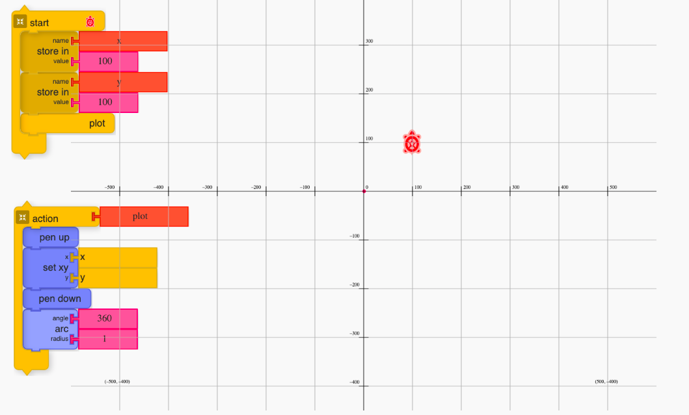
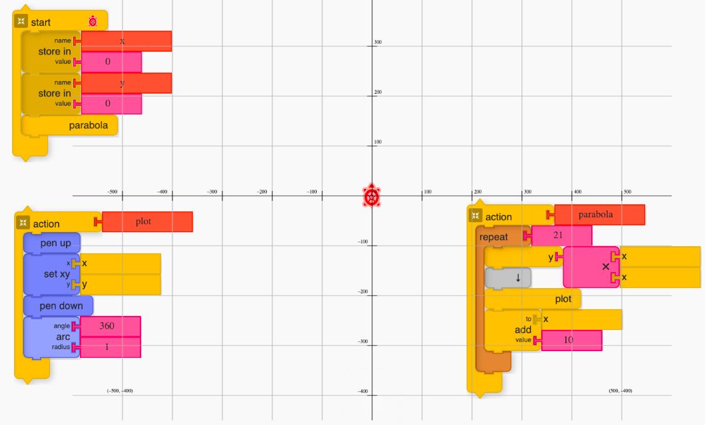

# Turtle Graphics to introduce Coordinate Geometry

Turtle Graphics has been considered as one of the powerful instansiation of of a constructionist microworld. approaches to introduce foundational programming concepts in an art-based context. Its potentiality has been explored by researchers to introduce mathematical ideas in a constructionist environment by DiSessa, Papert et al.

However, despite its popularity, the seamless integration in mathematics curricula of many of the boards in India has not been observed. There has been the peripheral introduction to the platform as one of the chapters in an ICT module in grade seven. 

In this article, we revisit the turtle Graphics and explore ways to elicit some of the curricular concepts more concretely. We start the exploration with ways to introduce coordinate geometry using turtle Graphics. We substantiate the case by demonstrating  three examples from coordinate geometry,  

- plotting a point
- plotting a straight line
- plotting a parabola

This approach can be extended to plot other common curves. The topics are part of the curriculum for grades 9 and 10. We have also created video resources using a "discourse-based approach" to serve as a teaching-learning resource. 

## Introduction to cartesian coordinate

## Why cartesian coordinate exploration with turtleArt?

## Concept Matrix  

## Plotting a point

## Plotting a straight line

## Plotting a parabola

## Conclusion

In the above section, we covered all the mathematical ideas which are generally introduced in for the first time in ninth grade level in NCERT curriculum which is the apex body guiding the curriculum design and development of textbooks for most of the schools when the coordinate geometry. We extended the same exploration gradually to introduce the concept of plotting two simple functions - a straight line and parabola. The exploration in turtle Graphics gives the concrete context for participants to develop familiarity and fluency in the concepts along with developing programming concepts like variables in background. This also demonstrates a potential way to integrate ICT in the curriculum and open up space for extending the current activities in the curriculum with an ICT based exploration which is mapped to the curriculum. The initial adoption requires one to develop familiarity with the microworld, but then hopefully the short investments of the to learn the platform can outweigh the benefits and the context which it brings to the learners as using the turtle as a manipulable relatable object and also opens up the door for building generic competency like graphicacy.

## References

## Notes

- 

